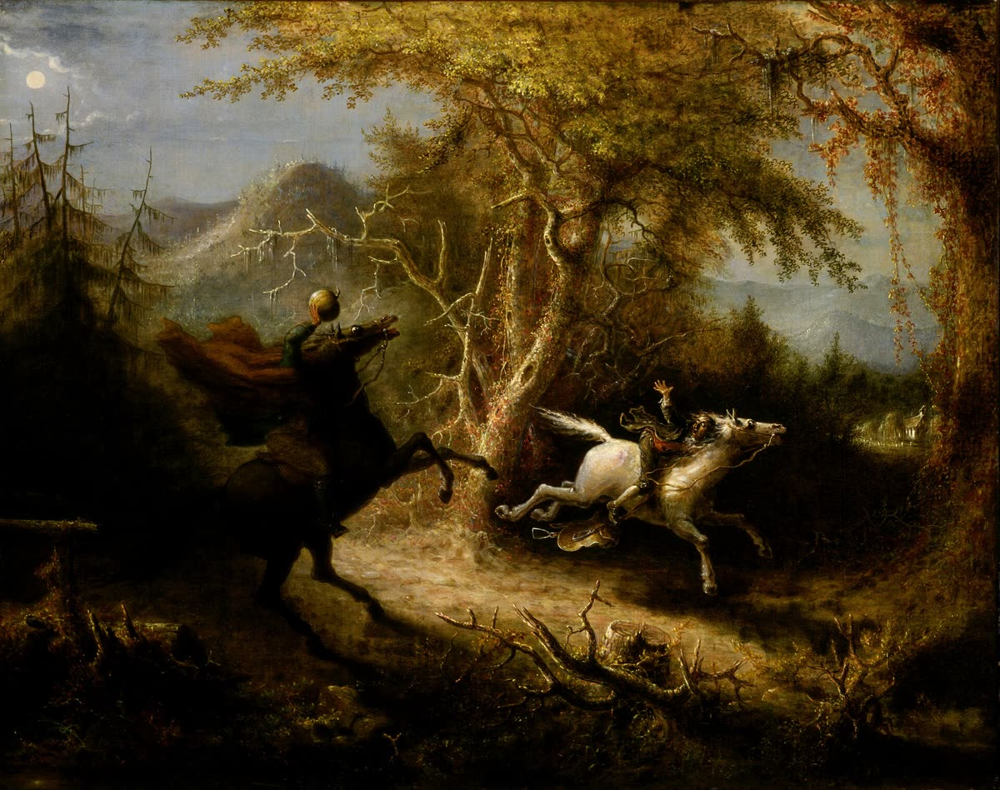
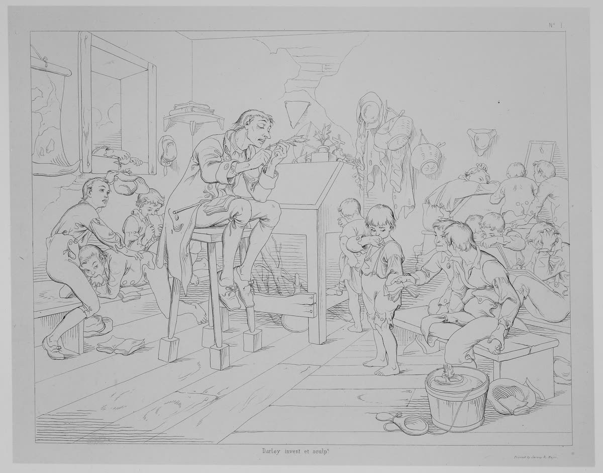
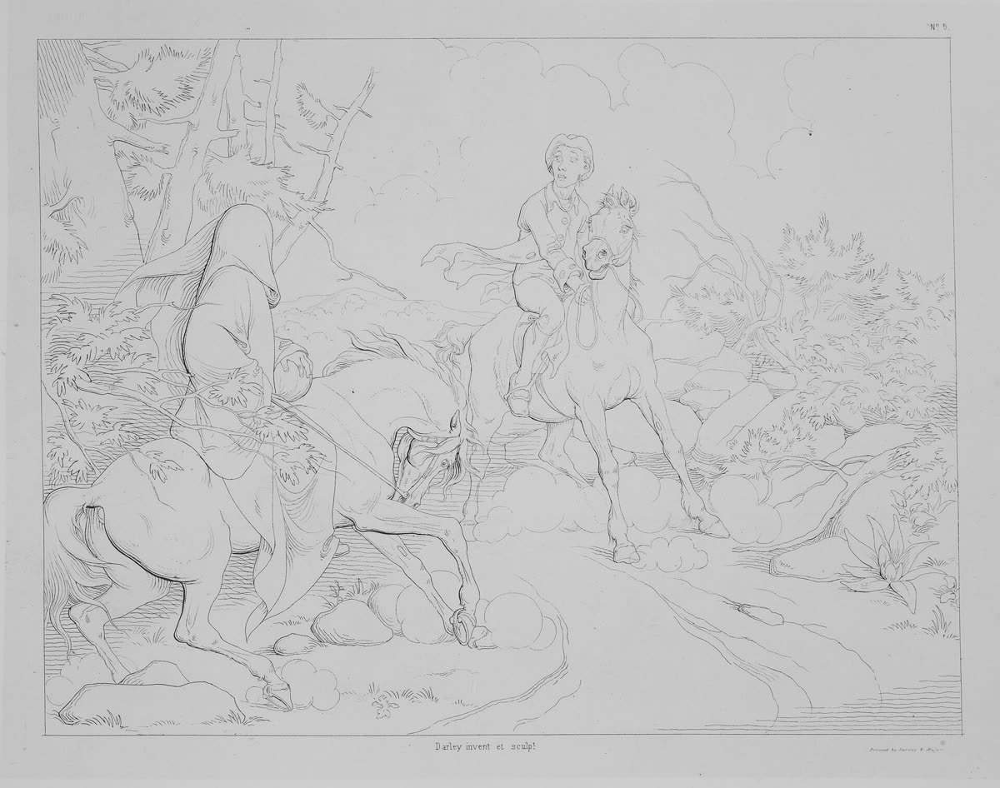
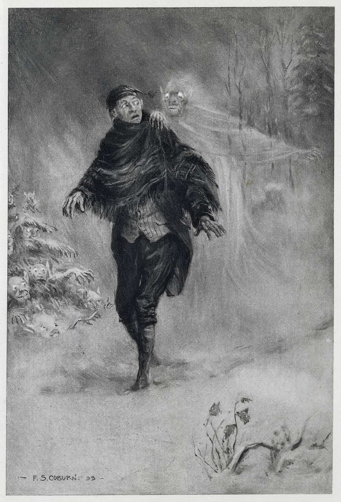
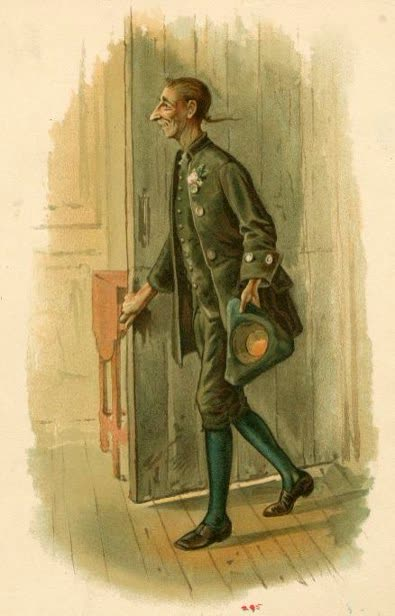
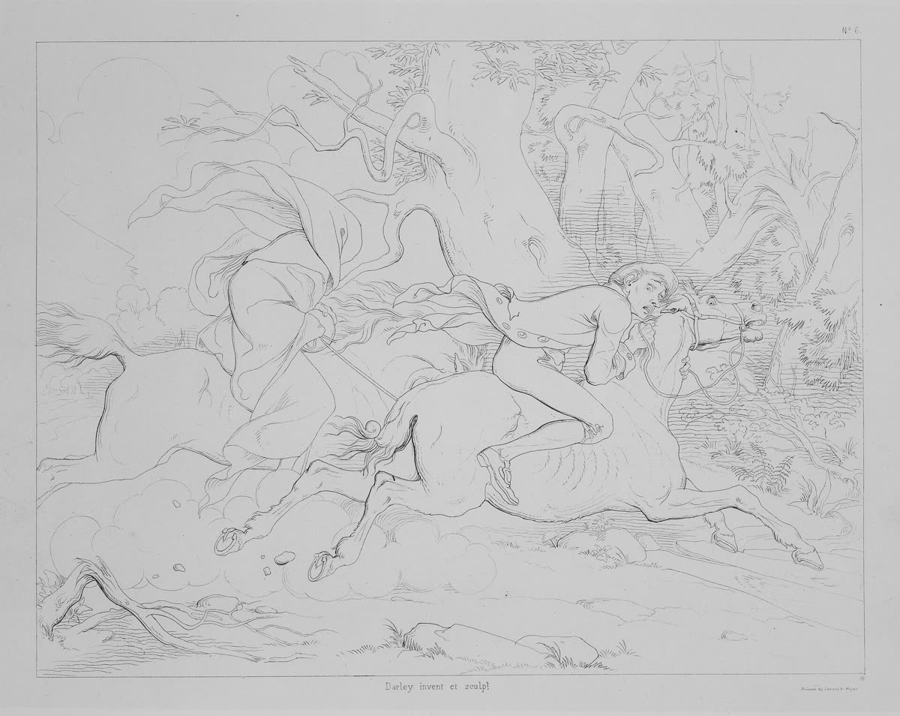
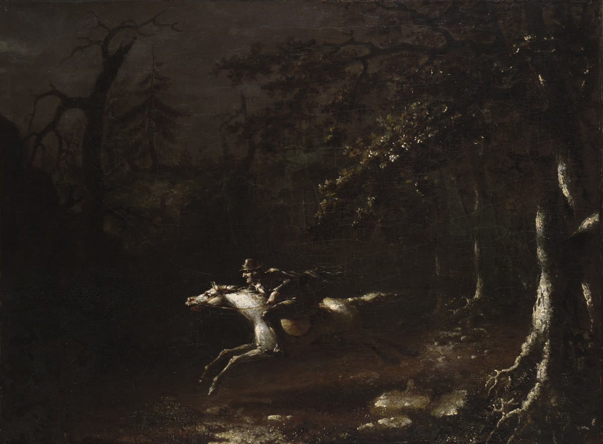

# Headless Horseman

<p align="center">
  
  <br>
  <sub>John Quidor, <i>The Headless Horseman Pursuing Ichabod Crane</i>, 1858. Smithsonian American Art Museum. Public domain.</sub>
</p>

> **This is a personal tool, published for reading, not for use.** It is wired to one
> person's machine: Homebrew tmux paths, a launchd label, a `~/bin` install, a message that
> refers to that person's own resume-file routine. Nobody else should actually install it.
> Borrow the idea, not the repo.

A weekday closing-time reminder for people who run several Claude Code threads in tmux and,
by late afternoon, forget which ones still have something worth doing before they shut down.

At a scheduled time (default 4pm Mon–Fri) a launchd job rides through the machine and:

1. posts a macOS notification,
2. plays a horse neigh and a laugh, both from a long way off,
3. shows a banner in every tmux session,
4. sends a shutdown message to every other Claude Code session on the machine through
   Claude's own session-to-session messaging, so each thread starts its own shutdown
   routine: list anything flagged as worth doing before shutdown, finish or explicitly defer
   each item, then write the thread's resume context.

The point of step 4 is that the reminder lands inside the threads, not just on the human.
Tired-Friday working memory is the thing that fails; the threads still remember.

<p align="center">
  
  <br>
  <sub>Ichabod at his desk, surrounded by unruly processes. F.O.C. Darley, 1850. The Met, public domain.</sub>
</p>

## Install

Requires macOS, Claude Code on a recent build (see below), tmux (Homebrew path assumed;
override with `HORSEMAN_TMUX`), and sox only if you want to rebuild the sound.

```
git clone https://github.com/jdonaldson/headless-horseman
cd headless-horseman
make install            # 4pm weekdays
make install HOUR=17    # or 5pm
make dry-run            # which Claude sessions would get the message, without sending
make fire               # ride now
```

`make status` shows the launchd state and the log tail. `make uninstall` removes everything.
If the Mac is asleep at the scheduled time, launchd fires the job once after wake.

## How it reaches Claude sessions

<p align="center">
  
  <br>
  <sub>The encounter. F.O.C. Darley, 1850. The Met, public domain.</sub>
</p>

The script starts a throwaway headless Claude session (`claude -p`, default model `haiku`)
and allows it exactly two tools: `ListAgents`, which lists the other Claude Code sessions on
the machine, and `SendMessage`, which delivers the shutdown message to each one. The
messenger prints one line per peer, `sent` or `failed`, and that goes to the log. Each
receiving session sees the message as a cross-session message from a peer and acts on it in
its own turn.

An earlier version typed the message into every tmux pane with `send-keys`. That worked on
any build but needed a guard against panes with a permission dialog open, where keystrokes
select options. Session messaging has no such problem.

## Compatibility

<p align="center">
  
  <br>
  <sub>"What fearful shapes and shadows beset his path." F. S. Coburn, 1899 edition. British Library, public domain.</sub>
</p>

**Only newer Claude Code builds are reached.** Sessions register as peers only on builds
with session-to-session messaging; verified on 2.1.288, while threads still running 2.1.286
and 2.1.287 on the same machine were invisible to `ListAgents`. Older threads still get the
notification, the sound and the tmux banner, but not the message. Restart a long-lived
thread on a current build if you want the Horseman to reach it.

A receiving session in a different permission mode from the headless messenger may hold the
message for its user's approval rather than acting on it. The messenger runs in the default
prompting mode; sessions in auto mode received the message directly in testing.

## Configuration

<p align="center">
  
  <br>
  <sub>Ichabod, dressed for the Van Tassels'. Edwin Austin Abbey. Public domain.</sub>
</p>

Environment variables read by `headless-horseman.sh` (set them in the plist, or export them
before `make fire`):

| Variable           | Default                                           | Meaning                                   |
| ------------------ | ------------------------------------------------- | ----------------------------------------- |
| `HORSEMAN_MESSAGE` | the shutdown message shown in the script          | text sent to each session and notified    |
| `HORSEMAN_SOUND`   | `~/.local/share/headless-horseman/horseman.wav`   | sound file to play; empty string disables |
| `HORSEMAN_TMUX`    | `/opt/homebrew/bin/tmux`                          | tmux binary                               |
| `HORSEMAN_CLAUDE`  | `~/.local/bin/claude`                             | claude binary for the messenger run       |
| `HORSEMAN_MODEL`   | `haiku`                                           | model for the messenger run               |

## The sound

<p align="center">
  
  <br>
  <sub>The chase. F.O.C. Darley, 1850. The Met, public domain.</sub>
</p>

The default, `sounds/horseman.wav`, is a real horse neighing in a large dark room, followed
by a maniacal laugh as the neigh fades. Both parts are recordings with sox reverb; the
components and alternates ship in `sounds/`:

| File                                  | What it is                                                                 | License |
| ------------------------------------- | -------------------------------------------------------------------------- | ------- |
| `horseman.wav`                        | default: `neigh-reverb.wav` with `cackle.wav` starting 2.4 s in            | CC BY-SA 3.0 (via the cackle) |
| `neigh.wav`                           | "Horse Neighing #3" by Joseph Sardin, [BigSoundBank](https://bigsoundbank.com/horse-neighing-3-s0863.html), normalized. Original mp3 kept alongside. | CC0 |
| `neigh-reverb.wav`                    | the same with a long hall reverb                                           | CC0 |
| `cackle.wav`                          | "Evil laugh 2" by Ondra Krist, [Wikimedia Commons](https://commons.wikimedia.org/wiki/File:Evillaugh.ogg), mono, same reverb. Original oga kept alongside. | [CC BY-SA 3.0](https://creativecommons.org/licenses/by-sa/3.0/) |
| `cackle-alt-horror-laugh-klankbeeld.ogg` | alternate laugh by klankbeeld, [Wikimedia Commons](https://commons.wikimedia.org/wiki/File:Horror_laugh.ogg), unprocessed | [CC BY 3.0](https://creativecommons.org/licenses/by/3.0/) |
| `cackle-alt-evil-laughter-stilgar.ogg` | alternate laugh by stilgar, [Wikimedia Commons](https://commons.wikimedia.org/wiki/File:Evil_laughter.ogg), 17 s, unprocessed | public domain |
| `neigh-wikimedia-wiehern.wav`         | alternate neigh by Hü, [Wikimedia Commons](https://commons.wikimedia.org/wiki/File:Wiehern.ogg), normalized | public domain |
| `neigh-synth.wav`                     | synthetic nightmare neigh from `tools/make_neigh.py` (stdlib only, deterministic, `make synth` regenerates it byte-for-byte) | none needed |

Pick one at install time with `make install SOUND=sounds/neigh-reverb.wav`, or point
`HORSEMAN_SOUND` at any wav, aiff or mp3 afterwards. To rebuild the processed files:

```
sox sounds/neigh.wav sounds/neigh-reverb.wav gain -4 pad 0 2.5 reverb 70 40 100 100 20 -1 channels 1 norm -1
sox sounds/cackle-evil-laugh-2-krist.oga sounds/cackle.wav channels 1 gain -4 pad 0 3 reverb 70 40 100 100 20 -1 channels 1 norm -1
sox -m sounds/neigh-reverb.wav "|sox sounds/cackle.wav -p pad 2.4" sounds/horseman.wav norm -1
```

## Logs

`~/Library/Logs/headless-horseman.log` records each fire and, per pane, whether the message
was sent or why it was skipped. launchd's own stdout/stderr goes to
`~/Library/Logs/headless-horseman.launchd.log`.

## Art

Everything in `art/` is public domain, downscaled to 1200 px from the sources below.

| File | Work | Source |
| ---- | ---- | ------ |
| `quidor-1858-headless-horseman-pursuing-ichabod-crane.jpg` | John Quidor, *The Headless Horseman Pursuing Ichabod Crane*, oil, 1858 | [Smithsonian American Art Museum via Wikimedia Commons](https://commons.wikimedia.org/wiki/File:John_Quidor_-_The_Headless_Horseman_Pursuing_Ichabod_Crane_-_Google_Art_Project.jpg) |
| `quidor-ichabod-crane-flying-from-the-headless-horseman.jpg` | John Quidor, *Ichabod Crane Flying from the Headless Horseman*, oil | [Yale University Art Gallery via Wikimedia Commons](https://commons.wikimedia.org/wiki/File:John_Quidor_-_Ichabod_Crane_Flying_from_the_Headless_Horseman_-_1948.68_-_Yale_University_Art_Gallery.jpg) |
| `darley-1850-plate-*.jpg` | F.O.C. Darley, *Illustrations of the Legend of Sleepy Hollow*, etchings for the American Art Union, 1850 (plates 1, 2, 5, 6) | [The Metropolitan Museum of Art via Wikimedia Commons](https://commons.wikimedia.org/wiki/Category:The_Legend_of_Sleepy_Hollow_illustrations) |
| `abbey-ichabod-crane.jpg` | Edwin Austin Abbey, *Ichabod Crane* | [Wikimedia Commons](https://commons.wikimedia.org/wiki/File:Edwin_Austin_Abbey_-_Ichabod_Crane.jpg) |
| `coburn-1899-fearful-shapes-and-shadows.jpg` | F. S. Coburn, frontispiece to the 1899 edition of *The Legend of Sleepy Hollow* | [British Library via Wikimedia Commons](https://commons.wikimedia.org/wiki/File:What_fearful_shapes_and_shadows_beset_his_path_-_The_Legend_of_Sleepy_Hollow_(1899),_frontispiece_-_BL.jpg) |

<p align="center">
  
  <br>
  <sub>Go home. John Quidor, <i>Ichabod Crane Flying from the Headless Horseman</i>. Yale University Art Gallery. Public domain.</sub>
</p>
